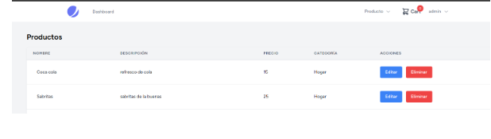
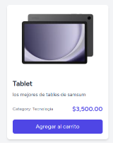
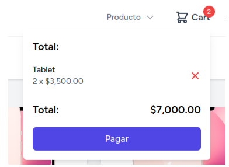
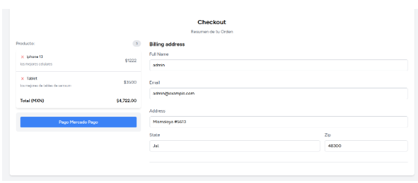
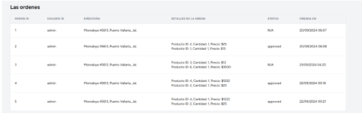

# Proyecto Final E-commerce 

### Bootcamp de PHP y Laravel de Codigo Facilito 

Este proyecto de E-commerce fue desarrollado como una oportunidad para aplicar y consolidar mis conocimientos en PHP y Laravel, adquiridos durante el bootcamp de Código Facilito. A través de esta plataforma, he integrado diversas funcionalidades esenciales en un sistema de comercio electrónico, desde la gestión de productos hasta el proceso de compra y pago, aplicando las mejores prácticas y tecnologías aprendidas.

**Tecnologia Utilizadas**

- **Laravel v11.9:** Framework principal para la estructura y lógica de la aplicación.
- **PHP v8.2** 
- **Livewire v3:** Para el manejo de componentes dinámicos y reactividad sin necesidad de JavaScript extenso.
- **Livewire Volt v1.6:** Extensión de Livewire para mejorar la interactividad y el rendimiento en la interfaz.
Mercado Pago: Plataforma utilizada para integrar el proceso de pago.
- **Spatie v6.4:** Paquete usado para la gestión de roles y permisos dentro del sistema.
Frontend
- **Tailwind CSS v3.4.0:** Framework de CSS utilizado para el diseño y estilización de la interfaz de usuario.

Instalacion y configuracion  
---

Clonación del proyecto de github:

```cli
git clone https://github.com/yakindario/ecommerce-proyecto-laravel.git
```

Instala las dependencias de PHP con Composer:
```
composer install 
```

Instala las dependencias de Node.js, necesarias para Tailwind CSS y otras herramientas de frontend:
```
npm install 
```

Ejecutar 
```
npm run dev
```

**Migración y seeders**

Ejecuta las migraciones y los seeders para configurar la base de datos con las tablas y datos iniciales:  
```
php artisan migrate --seed
```

Nota: Si prefieres ejecutar los seeders de manera individual, primero ejecuta el seeder para los roles y luego el seeder para los usuarios. Esto se puede hacer con los siguientes comandos:
```
php artisan db:seed --class=RoleSeeder
php artisan db:seed --class=UserSeeder
```
Estructura de proyecto 
---

**Sistema de Base de Datos del E-commerce**

Este sistema de E-commerce está construido sobre una base de datos relacional, organizada en varias tablas interconectadas. La estructura está diseñada cuidadosamente para gestionar de manera eficiente los usuarios, productos, órdenes y sus detalles, facilitando el flujo completo del proceso de compra.


### OrgaOrganización de las Carpetas

El proyecto está organizado de manera estructurada para facilitar el desarrollo y mantenimiento del sistema E-commerce. Los componentes de Livewire y las vistas correspondientes están organizados de la siguiente manera:

**Componentes de Livewire**

Los componentes se encuentran dentro de la carpeta app/Livewire, separados por funcionalidades específicas:

- **app/Livewire/Order:** Componentes relacionados con la gestión de órdenes.
- **app/Livewire/Product:** Componentes para la gestión de productos.
- **app/Livewire/Profile:** Componentes del perfil de usuario.
- **app/Livewire/Shopping:** Componentes del carrito de compras y procesos relacionados.


**Vistas de Livewire**

Las vistas de los componentes Livewire están organizadas en la carpeta resources/views/livewire, con subcarpetas específicas para cada módulo:

- **resources/views/livewire/product:** Vistas relacionadas con la gestión de productos.
- **resources/views/livewire/profile:** Vistas del perfil de usuario.
- **resources/views/livewire/shopping:** Vistas del carrito de compras.

Manejo de rutas
---

El manejo de las rutas en el proyecto sigue una estructura clara, utilizando tanto rutas básicas como rutas de recursos para las funcionalidades principales:

```php
Route::get('/orders',[OrderController::class,'index'])->name('checkout');
Route::resource('orders', OrderController::class)->only('store');
Route::get('callback/{order:uuid}', [OrderController::class, 'callback'])->name('config');
Route::get('/order',MyOrder::class)->name('myorder');
```

**Roles y permisos**
Para gestionar los roles y permisos en el sistema de e-commerce, se ha implementado el paquete Spatie. Este paquete permite controlar qué usuarios pueden acceder a ciertas funcionalidades, como la gestión de productos y órdenes.

En la clase RoleSeeder dentro de database/seeders/RoleSeeder.php, se definen los roles y permisos que se asignarán a los usuarios del sistema. A continuación se muestra cómo se configura:

```php
// creo el rol
$role1 = Role::create(['name' => 'admin']);
// creo el permiso
Permission::firstOrCreate(['name' => 'manage.products']);
//asigno el permiso al rol 
$role1->givePermissionTo('manage.products');

```

**Middleware**


Para reforzar la seguridad y control de acceso, se ha configurado un middleware utilizando el paquete Spatie. Este middleware permite restringir el acceso a rutas específicas basadas en el rol del usuario. Solo los usuarios con el rol de administrador pueden acceder a las rutas de administración, como la gestión de productos y órdenes.

En el siguiente grupo de rutas, el middleware 'role:admin' asegura que solo los administradores puedan realizar acciones como crear, actualizar productos y ver las órdenes de los usuarios:

```php
Route::group([
    'middleware' => ['role:admin'],
], function () {
    // products
    Route::get('/products', ProductsIndex::class)->name('products.index');
    Route::get('/products/create', ProductCreate::class)->name('products.create');
    Route::get('/products/update/{id}', ProductsUpdate::class)->name('products.update');
    Route::get('/admin/orders',OrderList::class)->name('admin.orders');
});
```

Gestión de los producto 
---

En el panel de administración, los usuarios con permisos podrán gestionar los productos del E-commerce. Desde aquí, se pueden visualizar, crear, editar y eliminar productos de manera eficiente.


En la sección "Todos los productos", se muestra una lista completa de los productos existentes. Cada producto tiene opciones para ser editado o eliminado según sea necesario. Además, si hay un gran número de productos, el sistema implementa una función de paginación en el controlador del componente Livewire para mejorar la navegación y carga de la lista.



Carritos de compras
---

Para gestionar los carritos de compras, se desarrolló inicialmente un componente de tarjeta de producto utilizando Volt de Livewire, el cual se visualiza en la página principal.



Al hacer clic en la opción “Agregar al carrito”, se implementa una lógica en PHP que utiliza la sesión y la caché para almacenar los productos seleccionados. Esto permite calcular la suma total de los productos en el carrito. Lo puedes encontrar en el archivo *app/Livewire/Shopping/ProductCard.php* 


```php
session(['cart' => $cart]);
Cache::put('cart', $cart, now()->addMinutes(30));
```

Se utiliza la caché para almacenar temporalmente los datos del carrito, mejorando así el rendimiento del sistema. Al guardar el carrito en la caché, se puede acceder a él de manera rápida y eficiente, sin necesidad de realizar consultas a la base de datos o recalcular el contenido del carrito. 

En este caso, los datos del carrito se mantienen en la caché durante 30 minutos, lo que garantiza una experiencia de usuario fluida. en este archivo lo puedes encontrar en app/Livewire/Shopping/ShoppingCart.php



Gestión de pago
---

La gestión de pagos en este proyecto sigue el patrón convencional de MVC (Modelo-Vista-Controlador) de Laravel. Se integró Mercado Pago como la plataforma para procesar los pagos, garantizando una experiencia de compra segura y eficiente.

**Proceso de Pago**


En la vista del checkout, se muestra un resumen detallado de los productos y el monto total a pagar. Desde esta pantalla, los usuarios pueden proceder con el pago utilizando Mercado Pago.



Estructura del Código

Controlador: El proceso de pago y la creación de órdenes están gestionados por el controlador ubicado en:

- *app/Http/Controllers/OrderController.php*


Modelos: Las órdenes y los detalles de cada una de ellas se manejan a través de los siguientes modelos:

- *app/Models/OrderDetail.php*
- *app/Models/Order.php*


Vista de Checkout: La vista encargada de mostrar el resumen del carrito y procesar el pago se encuentra en:

- *resources/views/orders/checkout.blade.php*

Gestión de las órdenes 
---

El sistema de gestión de órdenes permite a los administradores y a los usuarios visualizar y gestionar sus órdenes de manera eficiente.

**Vista del Administrador:** Los administradores tienen acceso a una lista completa de todas las órdenes realizadas por los usuarios a través del componente Livewire.

**Vista del Usuario:** Los usuarios pueden acceder a un historial de sus propias órdenes, facilitando la revisión y seguimiento de sus compras. Esta funcionalidad también se implementa utilizando Livewire.

**Componentes Livewire**

- *app/Livewire/Order/MyOrder.php:* Componente que gestiona y muestra las órdenes del usuario autenticado.
- *app/Livewire/Order/OrderList.php:* Componente que gestiona y muestra la lista de órdenes para los administradores.


Vistas Asociadas


- *resources/views/livewire/order/my-order.blade.php:* Vista que presenta al usuario sus órdenes personales.
- *resources/views/livewire/order/order-list.blade.php:* Vista que presenta al administrador la lista de todas las órdenes generadas en el sistema.



